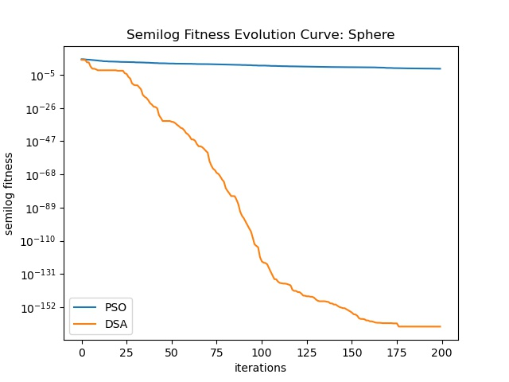
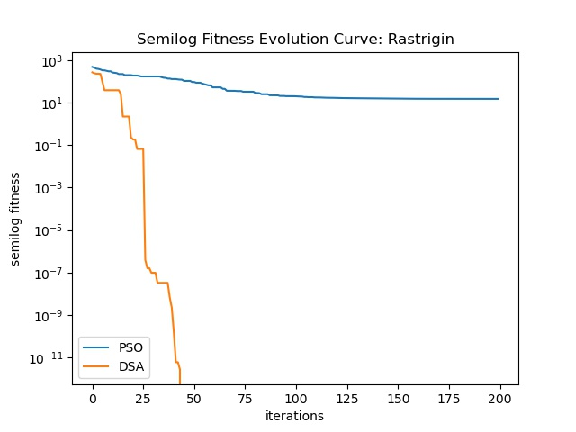

# Duck Swarm Algorithm (DSA)--鸭群算法
## Python代码根据论文中的伪代码实现，原文链接如下
###[Duck swarm algorithm: a novel swarm intelligence algorithm](https://arxiv.org/abs/2112.13508v1)
###目前只实现了 PSO 和 DSA 的对比，测试函数参考了下面两篇博文实现
####[第十九弹——23种标准测试函数解析~图像&公式&代码](https://zhuanlan.zhihu.com/p/397505364)
####[第二十弹——不常见的标准测试函数~图像&代码&公式](https://zhuanlan.zhihu.com/p/398507547)
###鸭群算法在多个测试函数上的表现都比PSO好，figures文件夹中保存了在17个测试函数上PSO对比DSA的适应度进化曲线，下面是两张例图

